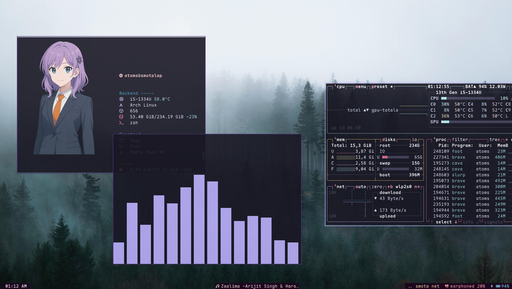

# aw - workspace 

this is my personal desktop setup that i use in a day to day basis.
I tried to build it mostly from scratch cause I didnt like the idea of having other peoples dotfiles mixed with 
mine.

I wouldnt recommend anyone to use it unless you daily a 60% layout keyboard , doesnt mind living without animations , 
prefers a custom made shitty UI with no eyecandy over smthn you'd see in reddit with blur and animations, you prefer speed 
over everything else 

(prolly no one will use this , no one should, but hey incase i forget)

## custom aliases/scripts that saves lives

`fcd()` - fcd stands for fast change directory i wrote this script so that i can easily cd fast with fuzzy finding 

`fcf()` - fcf is brother of fcd , fast change file ig it allows you to instantly jump to a different file (it will also open the file with a custom app)

`awa()` - starts local ollama model tuned with custom instructions to respond accordingly (working on this)

more timesavers will be added soon ()
most other scripts are keybinded via sway

## other custom stuff

opens custom made calendar website when date is right clicked ( I am not very proud of it due to loading times 
but might rewrite it in java or smthn)

## development 
neovim is setup for nodejs , typescript , java developement 
lots of custom keybinds here as well minimal setup but noways ideal by standards

## forced constraints 

only 3 workspaces this means i am more aware of which all windows i keep open and how i split things

minimizing the use of arrowkeys , cause i use a 60% keyboard and theres no arrow keys in it unless u press a combo 
which is hard to do

menu key bindings - its litterally a useless key so why not put it to some good use 

keyboard disabling - keyboard is disabled by default its changed during tty  login

sway&foot - sway is relaiable lightweight and less distracting , i dont care much about how it looks , same with foot

terminal for most things - cause i am a developer who lives there guis are so inconsitent and stuff

## inspiration 
major Inspiration for this setup is mostly from my frnd who's named after a musical instrument and does some 
cool stuff  🎷 

rose-pine theme i've modified it a bit , love the feel of it #bbaffa forever

